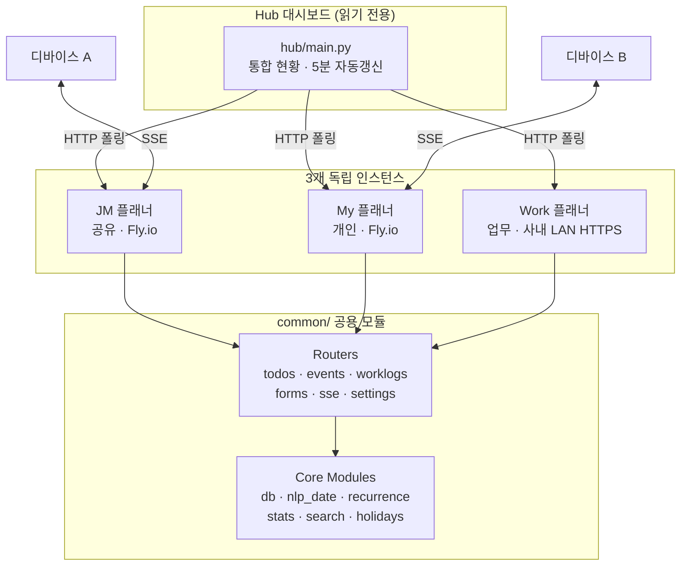

# Planner App

> 3개 독립 인스턴스(JM/My/Work)와 통합 허브로 구성된 멀티 플래너 웹 애플리케이션


## Overview

개인/공유/업무 용도별로 분리된 3개의 FastAPI 인스턴스와 이를 통합 조회하는 Hub 대시보드로 구성된 생산성 도구이다. 각 인스턴스는 독립 SQLite DB를 사용하면서 `common/` 공용 모듈을 공유하여 코드 중복 없이 용도별 커스터마이징이 가능하다. SSE 기반 실시간 동기화와 PWA 오프라인 지원으로 멀티 디바이스 환경을 지원한다.

## Tech Stack

| 영역 | 기술 |
|------|------|
| Backend | Python 3.11, FastAPI, Uvicorn |
| Frontend | HTMX, Tailwind CSS 3.4, Chart.js, Sortable.js |
| Database | SQLite (WAL mode) |
| Infra | Fly.io (JM/My), 로컬 HTTPS (Work) |
| 실시간 | Server-Sent Events (SSE) |
| 모바일 | PWA (Service Worker + manifest.json) |
| 테스트 | pytest |

## Architecture



## Key Features

- **할일 관리** -- CRUD, 우선순위/카테고리/태그, 에너지 레벨 필터, 서브태스크, 일괄 작업
- **캘린더** -- 월/주 뷰, 반복 일정 (일/주/월/연 + 예외일), 한국 공휴일 자동 반영
- **업무일지** -- 일별 기록, 카테고리별 시간 입력, 이미지 첨부, 엑셀 내보내기
- **집중 모드** -- Pomodoro 타이머 (25/45/60분), 업무일지 자동 기록 연동
- **양식 빌더** -- 커스텀 폼 생성 (품의서/회의록/업무일지 프리셋)
- **자동화 규칙** -- 규칙 기반 할일 자동 생성 (매일/매주/매월 트리거)
- **통계/리뷰** -- 완료 추이, 카테고리 분포, 365일 히트맵, 주간/월간 리뷰
- **자연어 날짜 파싱** -- 한국어 입력 ("다음주 월요일", "3일 후") 자동 변환

## Getting Started

```bash
pip install fastapi uvicorn[standard] jinja2 python-multipart httpx
cd my && python3 -m uvicorn main:app --host 0.0.0.0 --port 8002
# 테스트: python3 -m pytest tests/ -v
```

## Project Structure

```
app_planners/
├── common/             # 공용 모듈 (모든 인스턴스 공유)
│   ├── routers/        # FastAPI 라우터 (todos, events, worklogs, forms, sse ...)
│   ├── db.py           # SQLite WAL 연결
│   ├── nlp_date.py     # 한국어 자연어 날짜 파싱
│   ├── recurrence.py   # 반복 일정 엔진
│   └── stats.py        # 통계 집계
├── jm/                 # JM 인스턴스 (공유, Fly.io 배포)
├── my/                 # My 인스턴스 (개인, Fly.io 배포)
├── work/               # Work 인스턴스 (업무, 사내 LAN HTTPS)
├── hub/                # 통합 대시보드 (읽기 전용, HTTP 폴링)
├── tests/              # pytest (스모크, CRUD, NLP, QA)
├── deploy.sh           # Fly.io 배포 (Tailwind 빌드 + common 복사)
└── ci.sh               # CI (py_compile 구문검증 + pytest)
```

## Technical Decisions

- **멀티 인스턴스 + 공용 모듈 구조**: 용도별 독립 DB/배포를 유지하면서 `common/`으로 비즈니스 로직을 공유. 모놀리식의 단순함과 마이크로서비스의 격리를 절충했다.
- **HTMX + SSE 선택**: SPA 프레임워크 없이 서버 렌더링(Jinja2)과 HTMX로 인터랙션을 구현. SSE로 멀티 디바이스 실시간 동기화를 달성하면서 WebSocket 대비 구현 복잡도를 낮췄다.
- **SQLite WAL mode**: 동시 읽기/쓰기가 필요한 SSE + CRUD 환경에서 별도 DB 서버 없이 충분한 동시성을 확보. Fly.io 볼륨에 직접 마운트하여 운영 비용을 최소화했다.
